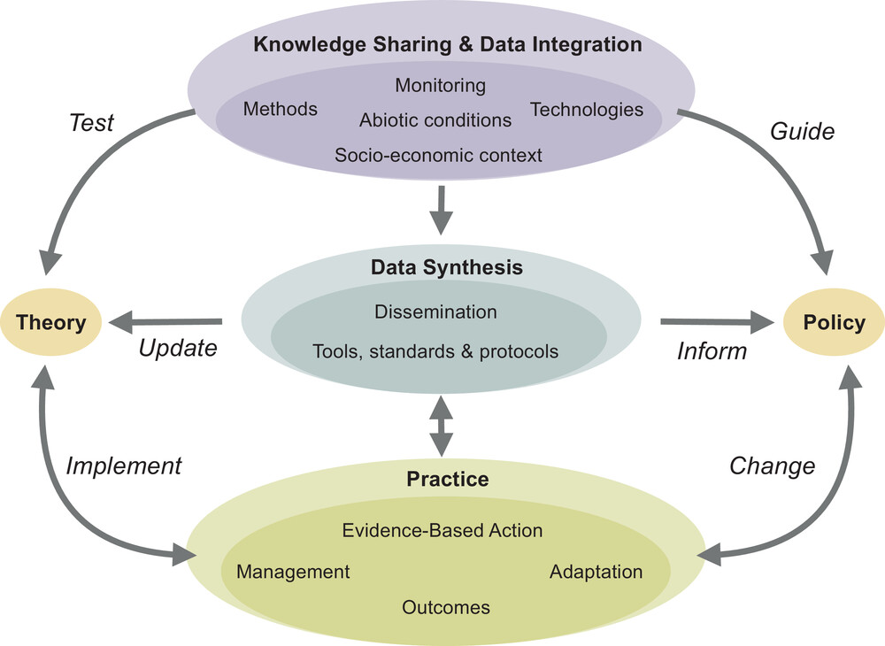

### Global Restore Project (GRP)

A database of ecological restoration projects around the world.

**Status:** `ongoing`

------------------------------------------------------------------------

### Summary

The Global Restore Project is a database of ecological restoration
projects around the world. Our vision for this project is long-term. We
are focused on collecting species-level community vegetation monitoring
data right now. In other words, we are interested in studies where folks
monitored all the species that occured in their monitoring samples. We
are gathering, and harmonising these data, and we plan to make them
open-acess as soon as we are able.

## Core team

**PI's**

-   Emma Ladouceur
-   Nancy Shackelford
-   Jonathan Chase

**Associated researches**

-   Jack Boyce
-   Diana Bertuol Garcia
-   Gustavo Paterno
-   Stan Harpole
-   Sybryn Maes
-   Holly Jones
-   Lars Brudvig

### Selected publications

Diana Bertuol-Garcia, Emma Ladouceur, Lars A. Brudvig, Daniel C.
Laughlin, Seth M. Munson, Michael F. Curran, Kirk W. Davies, Lauren N.
Svejcar, Nancy Shackelford 2023 Testing the hierarchy of predictability
in grassland restoration across a gradient of environmental severity
Ecological Applications

Emma Ladouceur, Forest Isbell, Adam T. Clark, W. Stanley Harpole, Peter
B. Reich, G. David Tilman, Jonathan M. Chase 2023 The recovery of plant
community composition following passive restoration across spatial
scales Journal of Ecology

Emma Ladouceur, Nancy Shackelford, Karma Bouazza, Lars Brudvig, Anna
Bucharova, Timo Conradi, Todd E. Erickson, Magda Garbowski, Kelly Garvy,
W. Stanley Harpole, Holly P. Jones, Tiffany Knight, Mlungele M. Nsikani,
Gustavo Paterno, Katharine Suding, Vicky M. Temperton, Péter Török,
Daniel E. Winkler, Jonathan M. Chase 2022 Knowledge sharing for shared
success in the decade on ecosystem restoration Ecological Solutions and
Evidence

Emma Ladouceur & Nancy Shackelford 2020 The power of data synthesis to
shape the future of the restoration community and capacity Restoration
Ecology

Shackelford, N., Paterno, G.B., Winkler, D.E. et al. 2021 Drivers of
seedling establishment success in dryland restoration efforts. Nature
Ecology & Evolution

