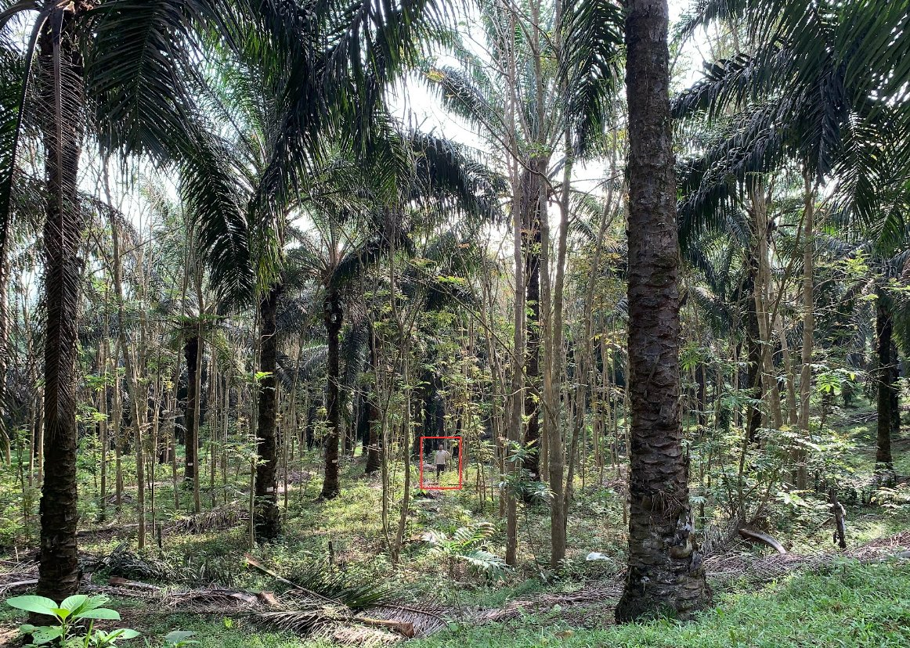

### EFForTS-BEE

Biodiversity enrichment in oil palm plantations: plant succession and
integration (EFForTS-BEE)

**Status:** `ongoing`

------------------------------------------------------------------------

### Summary

The transformation of rainforests into oil palm plantations leads to
dramatic losses in biodiversity and in ecological functioning. In order
to test possibilities for alleviation, we established a biodiversity
enrichment experiment by planting tree islands in an oil palm landscape,
systematically varying plot size and species number.

### Coordination team

**PI's**

-   Dr. Holger Kreft (University of Göttingen - Germany)
-   Dr. Dirk Hölscher (University of Göttingen - Germany)
-   Dr. Bambang Irawan (UNJA - Indonesia)
-   Dr. Leti Sundawati (IPB - Indonesia)

**Scientific coordination**

-   Gustavo Paterno (University of Göttingen - Germany)

**Associated researches**

-   Dr. Nathaly Guerrero-Ramirez
-   Dr. Fabiam Branbach
-   Dr. Delphine Clara Zemp

### Images

### Selected publications

Paterno, G. B., et al. (2024). **Diverse and larger tree islands promote
native tree diversity in oil palm landscapes**. Science, 386(6723),
795--802. [link](https://doi.org/10.1126/science.ado1629)

Zemp, D. C. et al. (2023). **Tree islands enhance biodiversity and
functioning in oil palm landscapes**. Nature, 1--6.
[link](https://doi.org/10.1038/s41586-023-06086-5)

Kikuchi, T. et al. (2024). **Combining planting trees and natural
regeneration promotes long-term structural complexity in oil palm
landscapes**. Forest Ecology and Management, 569, 122182.
[link](https://doi.org/10.1016/j.foreco.2024.122182)

Montoya-Sánchez, et al. (2023). **Landscape heterogeneity and soil biota
are central to multi-taxa diversity for oil palm landscape
restoration**. Communications Earth & Environment, 4(1), Article 1.
[link](https://doi.org/10.1038/s43247-023-00875-6)

