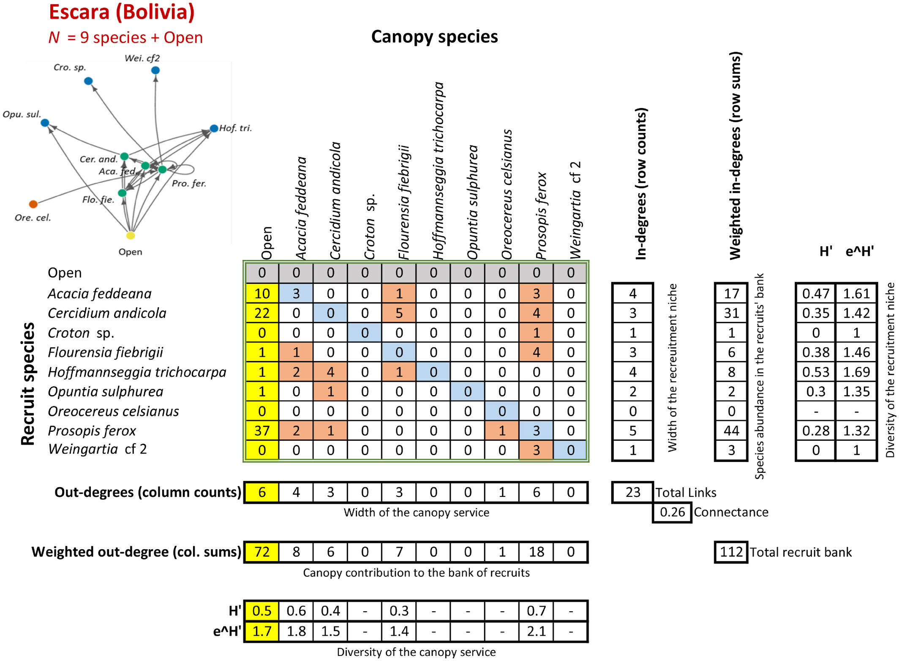

## Abstract

Plant–plant interactions are major determinants of the dynamics of terrestrial ecosystems. There is a long tradition in the study of these interactions, their mechanisms and their consequences using experimental, observational and theoretical approaches. Empirical studies overwhelmingly focus at the level of species pairs or small sets of species. Although empirical data on these interactions at the community level are scarce, such studies have gained pace in the last decade. Studying plant–plant interactions at the community level requires knowledge of which species interact with which others, so an ecological networks approach must be incorporated into the basic toolbox of plant community ecology. The concept of recruitment networks (RNs) provides an integrative framework and new insights for many topics in the field of plant community ecology. RNs synthesise the set of canopy–recruit interactions in a local plant assemblage. Canopy–recruit interactions describe which (“canopy”) species allow the recruitment of other species in their vicinity and how. Here we critically review basic concepts of ecological network theory as they apply to RNs. We use RecruitNet, a recently published worldwide data set of canopy–recruit interactions, to describe RN patterns emerging at the interaction, species, and community levels, and relate them to different abiotic gradients. Our results show that RNs can be sampled with high accuracy. The studies included in RecruitNet show a very high mean network completeness (95%), indicating that undetected canopy–recruit pairs must be few and occur very infrequently. Across 351,064 canopy–recruit pairs analysed, the effect of the interaction on recruitment was neutral in an average of 69% of the interactions per community, but the remaining interactions were positive (i.e. facilitative) five times more often than negative (i.e. competitive), and positive interactions had twice the strength of negative ones. Moreover, the frequency and strength of facilitation increases along a climatic aridity gradient worldwide, so the demography of plant communities is increasingly strongly dependent on facilitation as aridity increases. At network level, species can be ascribed to four functional types depending on their position in the network: core, satellite, strict transients and disturbance-dependent transients. This functional structure can allow a rough estimation of which species are more likely to persist. In RecruitNet communities, this functional structure most often departs from random null model expectation and could allow on average the persistence of 77% of the species in a local community. The functional structure of RNs also varies along the aridity gradient, but differently in shrubland than in forest communities. This variation suggests an increase in the probability of species persistence with aridity in forests, while such probability remains roughly constant along the gradient in shrublands. The different functional structure of RNs between forests and shrublands could contribute to explaining their co-occurrence as alternative stable states of the vegetation under the same climatic conditions. This review is not exhaustive of all the topics that can be addressed using the framework of RNs, but instead aims to present some of the interesting insights that it can bring to the field of plant community ecology.

## Citation

### BibTex

```         
@article{gleiserPhylogeneticArchitectureRecruitment2025,
  title = {The {{Phylogenetic Architecture}} of {{Recruitment Networks}}},
  author = {Gleiser, Gabriela and Alc{\'a}ntara, Julio M. and Bascompte, Jordi and Garrido, Jos{\'e} L. and Montesinos-Navarro, Alicia and Paterno, Gustavo B. and Valiente-Banuet, Alfonso and Verd{\'u}, Miguel},
  year = {2025},
  month = jan,
  journal = {Global Ecology and Biogeography},
  volume = {34},
  number = {1},
  pages = {e13944},
  issn = {1466-822X, 1466-8238},
  doi = {10.1111/geb.13944},
  urldate = {2024-12-16},
  abstract = {ABSTRACT                            Aim               Plant recruitment involves both stochastic and deterministic processes. Recruits may establish independently or interact nonrandomly with canopy plants. We explore this deterministic aspect by testing whether recruitment patterns are influenced by the phylogenetic history of canopy and recruiting plants. Since the effect of canopy plants in recruitment can be positive (facilitation), negative (competition) or neutral, we also estimated the phylogenetic signal separately for each interaction type. Furthermore, we assessed whether environmental stress influenced the phylogenetic signal, under the expectation that more severe environmental conditions will lead to stronger phylogenetic signatures in network structure.                                         Location               Global.                                         Time Period               1998--2021.                                         Major Taxa Studied               Angiospermae.                                         Methods               We analysed recruitment interactions occurring in 133 plant communities included in the RecruitNet database, which encompasses a wide range of biomes and vegetation types. The phylogenetic signal in canopy--recruit interactions was quantified in different dimensions of the recruitment niche, represented by the level of interaction generalisation, and by the taxonomic and evolutionary composition of the group of canopy plants.                                         Results               We found significant phylogenetic signals in more networks than expected by chance. Canopies' evolutionary history influenced facilitative and competitive but not neutral interactions. The phylogenetic signal in the recruitment niche strengthened in arid regions, suggesting that stressful habitats promote the occurrence of conserved recruitment interactions where closely related species recruit in association with closely related canopy species.                                         Main Conclusions               Despite the strong influence of stochastic processes on plant recruitment, evolutionary history plays a significant role in driving the recruitment process, especially in harsh environments. In particular, the historical effect becomes more important when canopy species have a significant impact on the performance of recruits, either through facilitation or competition. More generally, we show that the analysis of different dimensions of the ecological niche can reveal important insights on the functional roles of interacting species.},
  copyright = {All rights reserved},
  langid = {english}
}

```

### How to cite?

Alcántara, J. M., Verdú, M., Garrido, J. L., Montesinos‐Navarro, A., Aizen, M. A., Alifriqui, M., Allen, D., Al‐Namazi, A. A., Armas, C., Bastida, J. M., Bellido, T., Paterno, G. B., Briceño, H., Camargo De Oliveira, R. A., Campoy, J. G., Chaieb, G., Chu, C., Constantinou, E., Delalandre, L., … Zamora, R. (2024). Key concepts and a world‐wide look at plant recruitment networks. Biological Reviews, brv.13177. https://doi.org/10.1111/brv.13177


