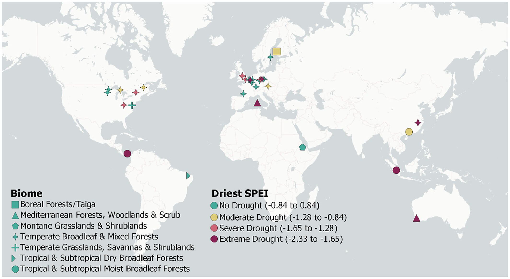

## Abstract

Enhancing tree diversity may be important to fostering resilience to drought-related climate extremes. So far, little attention has been given to whether tree diversity can increase the survival of trees and reduce its variability in young forest plantations. We conducted an analysis of seedling and sapling survival from 34 globally distributed tree diversity experiments (363,167 trees, 168 species, 3744 plots, 7 biomes) to answer two questions: (1) Do drought and tree diversity alter the mean and variability in plot-level tree survival, with higher and less variable survival as diversity increases? and (2) Do species that survive poorly in monocultures survive better in mixtures and do specific functional traits explain monoculture survival? Tree species richness reduced variability in plot-level survival, while functional diversity (Rao's Q entropy) increased survival and also reduced its variability. Importantly, the reduction in survival variability became stronger as drought severity increased. We found that species with low survival in monocultures survived comparatively better in mixtures when under drought. Species survival in monoculture was positively associated with drought resistance (indicated by hydraulic traits such as turgor loss point), plant height and conservative resource-acquisition traits (e.g. low leaf nitrogen concentration and small leaf size). Synthesis. The findings highlight: (1) The effectiveness of tree diversity for decreasing the variability in seedling and sapling survival under drought; and (2) the importance of drought resistance and associated traits to explain altered tree species survival in response to tree diversity and drought. From an ecological perspective, we recommend mixing be considered to stabilize tree survival, particularly when functionally diverse forests with drought-resistant species also promote high survival of drought-sensitive species.

## Citation 

### BibTex

``` 
@article{blondeelTreeDiversityReduces2024a,
  title = {Tree Diversity Reduces Variability in Sapling Survival under Drought},
  author = {Blondeel, Haben and Guillemot, Joann{\`e}s and Martin-StPaul, Nicolas and Druel, Ars{\`e}ne and Bilodeau-Gauthier, Simon and Bauhus, J{\"u}rgen and Grossiord, Charlotte and Hector, Andrew and Jactel, Herv{\'e} and Jensen, Joel and Messier, Christian and Muys, Bart and Serrano-Le{\'o}n, Hern{\'a}n and Auge, Harald and Barsoum, Nadia and Birhane, Emiru and Bruelheide, Helge and Cavender-Bares, Jeannine and Chu, Chengjin and Cumming, Jonathan R. and Damtew, Abebe and Eisenhauer, Nico and Ferlian, Olga and Fiedler, Sebastian and Ganade, Gislene and Godbold, Douglas L. and Gravel, Dominique and Hall, Jefferson S. and H{\"o}lscher, Dirk and Hulvey, Kristin B. and Koricheva, Julia and Kreft, Holger and Lapadat, Cathleen and Liang, Jingjing and Liu, Xiaojuan and Meredieu, C{\'e}line and Mereu, Simone and Montgomery, Rebecca and Morillas, Lourdes and Nock, Charles and Paquette, Alain and Parker, John D. and Parker, William C. and Paterno, Gustavo B. and Perring, Michael P. and Ponette, Quentin and Potvin, Catherine and Reich, Peter B. and Rentch, James and Rewald, Boris and Sand{\'e}n, Hans and Sinacore, Katherine and Standish, Rachel J. and Stefanski, Artur and Tobin, Patrick C. and Van Breugel, Michiel and Fagundes, Marina Vergara and Weih, Martin and Williams, Laura J. and Zhou, Mo and Scherer-Lorenzen, Michael and Verheyen, Kris and Baeten, Lander},
  year = {2024},
  month = apr,
  journal = {Journal of Ecology},
  pages = {1365-2745.14294},
  issn = {0022-0477, 1365-2745},
  doi = {10.1111/1365-2745.14294},
  urldate = {2024-04-19},
  abstract = {Abstract                                                                Enhancing tree diversity may be important to fostering resilience to drought-related climate extremes. So far, little attention has been given to whether tree diversity can increase the survival of trees and reduce its variability in young forest plantations.                                                     We conducted an analysis of seedling and sapling survival from 34 globally distributed tree diversity experiments (363,167 trees, 168 species, 3744 plots, 7 biomes) to answer two questions: (1) Do drought and tree diversity alter the mean and variability in plot-level tree survival, with higher and less variable survival as diversity increases? and (2) Do species that survive poorly in monocultures survive better in mixtures and do specific functional traits explain monoculture survival?                                                     Tree species richness reduced variability in plot-level survival, while functional diversity (Rao's Q entropy) increased survival and also reduced its variability. Importantly, the reduction in survival variability became stronger as drought severity increased. We found that species with low survival in monocultures survived comparatively better in mixtures when under drought. Species survival in monoculture was positively associated with drought resistance (indicated by hydraulic traits such as turgor loss point), plant height and conservative resource-acquisition traits (e.g. low leaf nitrogen concentration and small leaf size).                                                                          Synthesis.                     The findings highlight: (1) The effectiveness of tree diversity for decreasing the variability in seedling and sapling survival under drought; and (2) the importance of drought resistance and associated traits to explain altered tree species survival in response to tree diversity and drought. From an ecological perspective, we recommend mixing be considered to stabilize tree survival, particularly when functionally diverse forests with drought-resistant species also promote high survival of drought-sensitive species.},
  copyright = {All rights reserved},
  langid = {english}
}

}
``` 

### How to cite?

Blondeel, H., Guillemot, J., Martin-StPaul, N., Druel, A., Bilodeau-Gauthier, S., Bauhus, J., Grossiord, C., Hector, A., Jactel, H., Jensen, J., Messier, C., Muys, B., Serrano-León, H., Auge, H., Barsoum, N., Birhane, E., Bruelheide, H., Cavender-Bares, J., Chu, C., … Baeten, L. (2024). Tree diversity reduces variability in sapling survival under drought. Journal of Ecology, 112, 1164–1180. https://doi.org/10.1111/1365-2745.14294 


