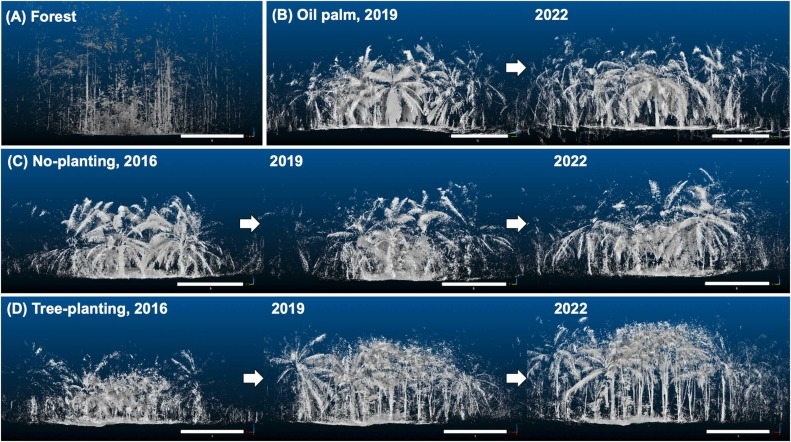

## Abstract

Vegetation structural complexity has been identified as a vital factor for forest ecosystem function, stability, and resilience. However, agricultural land with much reduced structural complexity has largely replaced natural forests in the tropics. Therefore, restoring structural complexity in large-scale plantation monocultures by introducing agroforestry systems may counteract the loss of biodiversity and ecosystem functions. However, we still have limited knowledge of how the structural complexity of agroforests develops under different restoration treatments. We established a large-scale biodiversity enrichment experiment in a conventional monoculture oil palm plantation in Sumatra, Indonesia. In this experiment, agroforests were implemented by planting clusters of native trees ("tree islands") within the oil palm plantation, systematically varying initially planted tree richness ranging from 0--6 (0 corresponding to natural regeneration only) and plot area (25--1600 m2). We tested the effect of the experimental treatments on nine years of the development of local structural complexity using a stand structural complexity index (SSCI) derived from terrestrial laser scanning. We found that tree planting and natural regeneration treatments promoted structural complexity by creating denser and more complex vegetation structures. Plots with a tree planting treatment tended to show greater structural complexity than plots with natural regeneration only. However, during the study period, oil palms still dominated heights, and the temporal change in structural complexity among plots with or without a tree planting treatment did not differ. As for plot area, our results indicate that structural complexity looking from the center of plots did not necessarily depend on the area during the study period, and even small tree islands can increase local structural complexity in a monoculture oil palm plantation. Initially planted tree richness did not significantly affect the development of structural complexity. Nine years after establishment, not planted trees but regenerated woody plants strongly positively affected vegetation density and structural complexity. Our findings highlight that sustaining vegetation density below oil palm canopies is a key strategy to increase the structural complexity of oil palm landscapes.

## Citation

### BibTex

```         
@article{kikuchiCombiningPlantingTrees2024,
  title = {Combining Planting Trees and Natural Regeneration Promotes Long-Term Structural Complexity in Oil Palm Landscapes},
  author = {Kikuchi, Tatsuro and Seidel, Dominik and Ehbrecht, Martin and Zemp, Delphine Clara and Brambach, Fabian and Irawan, Bambang and Sundawati, Leti and H{\"o}lscher, Dirk and Kreft, Holger and Paterno, Gustavo Brant},
  year = {2024},
  month = oct,
  journal = {Forest Ecology and Management},
  volume = {569},
  pages = {122182},
  issn = {03781127},
  doi = {10.1016/j.foreco.2024.122182},
  urldate = {2024-08-02},
  copyright = {All rights reserved},
  langid = {english}
}

}
```

### How to cite?

Kikuchi, T., Seidel, D., Ehbrecht, M., Zemp, D. C., Brambach, F., Irawan, B., Sundawati, L., Hölscher, D., Kreft, H., & Paterno, G. B. (2024). Combining planting trees and natural regeneration promotes long-term structural complexity in oil palm landscapes. Forest Ecology and Management, 569, 122182. <https://doi.org/10.1016/j.foreco.2024.122182>
