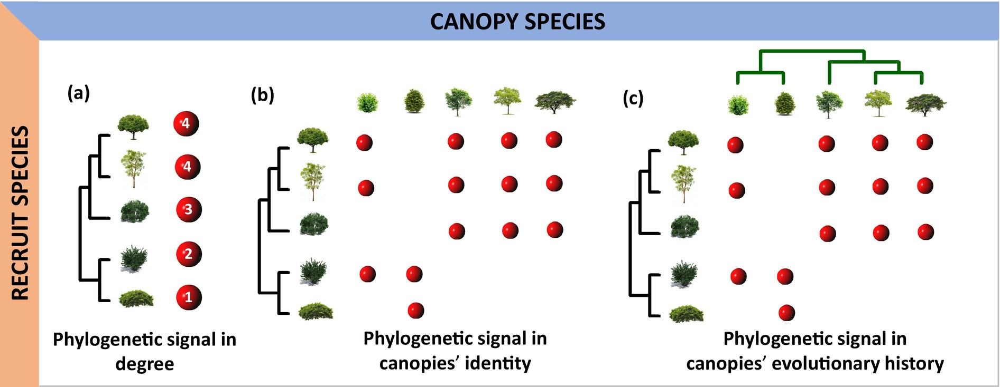

## Abstract

Plant recruitment involves both stochastic and deterministic processes. Recruits may establish independently or interact nonrandomly with canopy plants. We explore this deterministic aspect by testing whether recruitment patterns are influenced by the phylogenetic history of canopy and recruiting plants. Since the effect of canopy plants in recruitment can be positive (facilitation), negative (competition) or neutral, we also estimated the phylogenetic signal separately for each interaction type. Furthermore, we assessed whether environmental stress influenced the phylogenetic signal, under the expectation that more severe environmental conditions will lead to stronger phylogenetic signatures in network structure. We analysed recruitment interactions occurring in 133 plant communities included in the RecruitNet database, which encompasses a wide range of biomes and vegetation types. The phylogenetic signal in canopy--recruit interactions was quantified in different dimensions of the recruitment niche, represented by the level of interaction generalisation, and by the taxonomic and evolutionary composition of the group of canopy plants. We found significant phylogenetic signals in more networks than expected by chance. Canopies' evolutionary history influenced facilitative and competitive but not neutral interactions. The phylogenetic signal in the recruitment niche strengthened in arid regions, suggesting that stressful habitats promote the occurrence of conserved recruitment interactions where closely related species recruit in association with closely related canopy species. Despite the strong influence of stochastic processes on plant recruitment, evolutionary history plays a significant role in driving the recruitment process, especially in harsh environments. In particular, the historical effect becomes more important when canopy species have a significant impact on the performance of recruits, either through facilitation or competition. More generally, we show that the analysis of different dimensions of the ecological niche can reveal important insights on the functional roles of interacting species.

## Citation

### BibTex

```         
@article{gleiserPhylogeneticArchitectureRecruitment2025,
  title = {The {{Phylogenetic Architecture}} of {{Recruitment Networks}}},
  author = {Gleiser, Gabriela and Alc{\'a}ntara, Julio M. and Bascompte, Jordi and Garrido, Jos{\'e} L. and Montesinos-Navarro, Alicia and Paterno, Gustavo B. and Valiente-Banuet, Alfonso and Verd{\'u}, Miguel},
  year = {2025},
  month = jan,
  journal = {Global Ecology and Biogeography},
  volume = {34},
  number = {1},
  pages = {e13944},
  issn = {1466-822X, 1466-8238},
  doi = {10.1111/geb.13944},
  urldate = {2024-12-16},
  abstract = {ABSTRACT                            Aim               Plant recruitment involves both stochastic and deterministic processes. Recruits may establish independently or interact nonrandomly with canopy plants. We explore this deterministic aspect by testing whether recruitment patterns are influenced by the phylogenetic history of canopy and recruiting plants. Since the effect of canopy plants in recruitment can be positive (facilitation), negative (competition) or neutral, we also estimated the phylogenetic signal separately for each interaction type. Furthermore, we assessed whether environmental stress influenced the phylogenetic signal, under the expectation that more severe environmental conditions will lead to stronger phylogenetic signatures in network structure.                                         Location               Global.                                         Time Period               1998--2021.                                         Major Taxa Studied               Angiospermae.                                         Methods               We analysed recruitment interactions occurring in 133 plant communities included in the RecruitNet database, which encompasses a wide range of biomes and vegetation types. The phylogenetic signal in canopy--recruit interactions was quantified in different dimensions of the recruitment niche, represented by the level of interaction generalisation, and by the taxonomic and evolutionary composition of the group of canopy plants.                                         Results               We found significant phylogenetic signals in more networks than expected by chance. Canopies' evolutionary history influenced facilitative and competitive but not neutral interactions. The phylogenetic signal in the recruitment niche strengthened in arid regions, suggesting that stressful habitats promote the occurrence of conserved recruitment interactions where closely related species recruit in association with closely related canopy species.                                         Main Conclusions               Despite the strong influence of stochastic processes on plant recruitment, evolutionary history plays a significant role in driving the recruitment process, especially in harsh environments. In particular, the historical effect becomes more important when canopy species have a significant impact on the performance of recruits, either through facilitation or competition. More generally, we show that the analysis of different dimensions of the ecological niche can reveal important insights on the functional roles of interacting species.},
  copyright = {All rights reserved},
  langid = {english}
}
```

### How to cite?

Gleiser, G., Alcántara, J. M., Bascompte, J., Garrido, J. L., Montesinos‐Navarro, A., Paterno, G. B., Valiente‐Banuet, A., & Verdú, M. (2025). The Phylogenetic Architecture of Recruitment Networks. Global Ecology and Biogeography, 34(1), e13944. https://doi.org/10.1111/geb.13944


