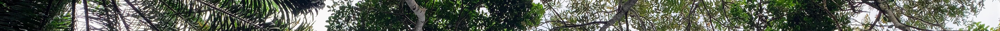
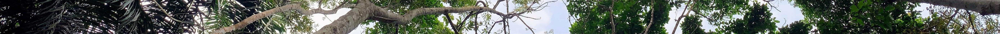

# Publications

See below for a list of all my publications. Also check out my [Google scholar](https://scholar.google.com/citations?user=uNxyHMkAAAAJ&hl=en) profile.

\*<i>corresponding author</i>   +<i>senior author</i>  
<i class="fa-solid fa-star"></i> Selected publications.

## Peer-reviewed papers

### **2025**

> 29.  Gleiser, G., Alcántara, J. M., Bascompte, J., Garrido, J. L., Montesinos‐Navarro, A.,<u>**Paterno, G.B.**</u>, Valiente‐Banuet, A., & Verdú, M. (2025). [The Phylogenetic Architecture of Recruitment Networks](/publication/2025-gleiser). Global Ecology and Biogeography, 34(1), e13944. [\[doi\]](https://doi.org/10.1111/geb.13944)

### **2024**

> 28.  Alcántara, J. M., Verdú, M., Garrido, J. L., Montesinos‐Navarro, A., Aizen, M. A., Alifriqui, M., Allen, D., Al‐Namazi, A. A., Armas, C., Bastida, J. M., Bellido, T., Paterno, G. B., Briceño, H., Camargo De Oliveira, R. A., Campoy, J. G., Chaieb, G., Chu, C., Constantinou, E., Delalandre, L., ...<u>**Paterno, G.B.**</u>... Zamora, R. (2024). [Key concepts and a world‐wide look at plant recruitment networks](/publication/2024-alcantara/). Biological Reviews, brv.13177. [\[doi\]](https://doi.org/10.1111/brv.13177)

> 27.  <i class="fa-solid fa-star"></i><u> **Paterno, G.B.**</u>\*\*\*\*\*, Brambach, F., Guerrero-Ramírez, N., Zemp, D. C., Cantillo, A. F., Camarretta, N., Moura, C. C. M., Gailing, O., Ballauff, J., Polle, A., Schlund, M., Erasmi, S., Iddris, N. A., Khokthong, W., Sundawati, L., Irawan, B., Hölscher, D., & Kreft, H. (2024). [Diverse and larger tree islands promote native tree diversity in oil palm landscapes](/publication/2024-paterno/). Science, 386(6723), 795--802.[\[doi\]](https://doi.org/10.1126/science.ado1629)

> 26.  Kikuchi, T., Seidel, D., Ehbrecht, M., Zemp, D. C., Brambach, F., Irawan, B., Sundawati, L., Hölscher, D., Kreft, H., & <u>**Paterno, G.B.**</u>+ (2024). [Combining planting trees and natural regeneration promotes long-term structural complexity in oil palm landscapes](/publication/2024-kikuchi/). Forest Ecology and Management, 569, 122182. [\[doi\]](https://doi.org/10.1016/j.foreco.2024.122182).

> 25.  Montoya-Sánchez, V., Camarretta, N., Ehbrecht, M., Schlund, M., **Paterno, G.B.**, Seidel, D., Guerrero-Ramírez, N., Brambach, F., Hölscher, D., Kreft, H., Irawan, B., Sundawati, L., & Zemp, D. C. (2024). Comparing airborne and terrestrial LiDAR with ground-based inventory metrics of vegetation structural complexity in oil palm agroforests. Ecological Indicators, 166, 112306. [\[doi\]](https://doi.org/10.1016/j.ecolind.2024.112306)

> 24.  Luo, S., Schmid, B., Hector, A., Scherer‐Lorenzen, M., Verheyen, K., Barsoum, N., Bauhus, J., Beyer, F., Bruelheide, H., Ferlian, O., Godbold, D., Hall, J. S., Hajek, P., Huang, Y., Hölscher, D., Kreft, H., Liu, X., Messier, C., Nock, C., ... <u>**Paterno, G.B.**</u> ... Eisenhauer, N. (2024). Mycorrhizal associations modify tree diversity−productivity relationships across experimental tree plantations. New Phytologist, 243(3), 1205--1219. [\[doi\]](https://doi.org/10.1111/nph.19889)

> 23.  Wenzel, A., Westphal, C., Ballauff, J., Berkelmann, D., Brambach, F., Buchori, D., Camarretta, N., Corre, M. D., Daniel, R., Darras, K., Erasmi, S., Formaglio, G., Hölscher, D., Iddris, N. A.-A., Irawan, B., Knohl, A., Kotowska, M. M., Krashevska, V., Kreft, H., ... <u>**Paterno, G.B.**</u> ... Grass, I. (2024). Balancing economic and ecological functions in smallholder and industrial oil palm plantations. Proceedings of the National Academy of Sciences, 121(17), e2307220121. [\[doi\]](https://doi.org/10.1073/pnas.2307220121)

> 22.  Blondeel, H., Guillemot, J., Martin‐StPaul, N., Druel, A., Bilodeau‐Gauthier, S., Bauhus, J., Grossiord, C., Hector, A., Jactel, H., Jensen, J., Messier, C., Muys, B., Serrano‐León, H., Auge, H., Barsoum, N., Birhane, E., Bruelheide, H., Cavender‐Bares, J., Chu, C., ... <u>**Paterno, G.B.**</u> ... Baeten, L. (2024). Tree diversity reduces variability in sapling survival under drought. Journal of Ecology, 1365-2745.14294. [\[doi\]](https://doi.org/10.1111/1365-2745.14294)

> 21.  Zheng, L., Barry, K. E., Guerrero-Ramírez, N. R., Craven, D., Reich, P. B., Verheyen, K., Scherer-Lorenzen, M., Eisenhauer, N., Barsoum, N., Bauhus, J., Bruelheide, H., Cavender-Bares, J., Dolezal, J., Auge, H., Fagundes, M. V., Ferlian, O., Fiedler, S., Forrester, D. I., Ganade, G.,... <u>**Paterno, G.B.**</u> ... Hautier, Y. (2024). Effects of plant diversity on productivity strengthen over time due to trait-dependent shifts in species overyielding. Nature Communications, 15(1), 2078. [\[doi\]](https://doi.org/10.1038/s41467-024-46355-z)

> 20.  Depauw, L., De Lombaerde, E., Dhiedt, E., Blondeel, H., Abdala-Roberts, L., Auge, H., Barsoum, N., Bauhus, J., Chu, C., Damtew, A., Eisenhauer, N., Fagundes, M. V., Ganade, G., Gendreau-Berthiaume, B., Godbold, D., Gravel, D., Guillemot, J., Hajek, P., Hector, A., ... <u>**Paterno, G.B.**</u> ... Baeten, L. (2024). Enhancing Tree Performance Through Species Mixing: Review of a Quarter-Century of TreeDivNet Experiments Reveals Research Gaps and Practical Insights. Current Forestry Reports. [\[doi\]](https://doi.org/10.1007/s40725-023-00208-y)

### **2023**

> 19.  <i class="fa-solid fa-star"></i> Zemp, D. C., Guerrero-Ramirez, N., Brambach, F., Darras, K., Grass, I., Potapov, A., Röll, A., Arimond, I., Ballauff, J., Behling, H., Berkelmann, D., Biagioni, S., Buchori, D., Craven, D., Daniel, R., Gailing, O., Ellsäßer, F., Fardiansah, R., Hennings, N.,... <u>**Paterno, G.B.**</u> ... Kreft, H. (2023). Tree islands enhance biodiversity and functioning in oil palm landscapes. Nature, 1--6. [\[doi\]](https://doi.org/10.1038/s41586-023-06086-5)**(highly cited paper)**

> 18.  Verdú, M., Garrido, J. L., Alcántara, J. M., Montesinos-Navarro, A., Aguilar, S., Aizen, M. A., Al-Namazi, A. A., Alifriqui, M., Allen, D., Anderson-Teixeira, K. J., Armas, C., Bastida, J. M., Bellido, T., Bonanomi, G., <u>**Paterno, G.B.**</u>, Briceño, H., de Oliveira, R. A. C., Campoy, J. G., Chaieb, G., ... Zamora, R. (2023). RecruitNet: A global database of plant recruitment networks. Ecology, 104(2), e3923. [\[doi\]](https://doi.org/10.1002/ecy.3923).

## **2022**

> 17.  Guzmán‐Jacob, V., Guerrero‐Ramírez, N. R., Craven, D.,<u>**Paterno, G.B.**</u>, Taylor, A., Krömer, T., Wanek, W., Zotz, G., & Kreft, H. (2022). Broad‐ and small‐scale environmental gradients drive variation in chemical, but not morphological, leaf traits of vascular epiphytes. Functional Ecology, April, 1--15. [\[doi\]](https://doi.org/10.1111/1365-2435.14084).

> 16.  <i class="fa-solid fa-star"></i> Fonseca, Carlos; Gossner, Martin; Kollmann, Johannes; Brändle, Martin; <u>**Paterno, G.B.**\*</u>, Insect herbivores modulate flower sex evolution. Ecology Letters 25 (10). \[[doi](https://onlinelibrary.wiley.com/doi/10.1111/ele.14092)\] / [data](https://zenodo.org/record/6938972) / [osf](https://osf.io/htvgz/)\]. **(\* corresponding author)**

> 15.  Wolff, J. O., Wierucka, K., <u>**Paterno, G.B.**</u>, Coddington, J. A., Hormiga, G., Kelly, M. B. J., Herberstein, M. E., & Ramírez, M. J. (2022). Stabilized morphological evolution of spiders despite mosaic changes in foraging ecology. Systematic Biology. [\[doi\]](https://doi.org/10.1093/sysbio/syac023).

> 14.  Ladouceur, E., Shackelford, N., Bouazza, K., Brudvig, L., Bucharova, A., Conradi, T., Erickson, T. E., Garbowski, M., Garvy, K., Harpole, W. S., Jones, H. P., Knight, T., Nsikani, M. M., <u>**Paterno, G.B.**</u>, Suding, K., Temperton, V. M., Török, P., Winkler, D. E., & Chase, J. M. (2022). Knowledge sharing for shared success in the decade on ecosystem restoration. Ecological Solutions and Evidence, 3, e12117. \[[doi](https://doi.org/10.1002/2688-8319.12117) / [pdf](https://besjournals.onlinelibrary.wiley.com/doi/epdf/10.1002/2688-8319.12117) / [data](https://doi.org/10.6084/m9.figshare.17048207.v2)\]. **(highly cited paper)**

### **2021**

> 13.  Franco, J. R. A.,<u>**Paterno, G.B.**</u>, & Ganade, G. (2022). The influence of herbaceous vegetation on the colonization of native and invasive trees: Consequences for semiarid forest restoration. Restoration Ecology, 30(5), e13595. [\[doi\]](https://doi.org/10.1111/rec.13595)

> 12.  <i class="fa-solid fa-star"></i> Shackelford, N., <u>**Paterno, G.B.**</u>, Winkler, D. E., Erickson, T. E., Leger, E. A., Svejcar, L. N., Breed, M. F., Faist, A. M., Harrison, P. A., Curran, M. F., Guo, Q., Kirmer, A., Law, D. J., Mganga, K. Z., Munson, S. M., Porensky, L. M., Quiroga, R. E., Török, P., Wainwright, C. E., ... Suding, K. L. (2021). Drivers of seedling establishment success in dryland restoration efforts. Nature Ecology & Evolution. \[[doi](https://doi.org/10.1038/s41559-021-01510-3)/ [code](https://zenodo.org/record/5062861#.YRI7CjqxVH4)/[data](https://zenodo.org/record/5062861#.YRI7CjqxVH4)\] **(shared first authorship)**

> 11.  Fonseca, C. R., <u>**Paterno, G.B.**</u>, Guadagnin, D. L., Venticinque, E. M., Overbeck, G. E., Ganade, G., Metzger, J. P., Kollmann, J., Sauer, J., Cardoso, M. Z., Lopes, P. F. M., Oliveira, R. S., Pillar, V. D., & Weisser, W. W. (2021). Conservation biology: Four decades of problem- and solution-based research. Perspectives in Ecology and Conservation, 19(2), 121--130. \[[doi](https://doi.org/10.1016/j.pecon.2021.03.003)\]

### **2020**

> 10.  Cássia-Silva, C., Freitas, C. G., Lemes, L. P., <u>**Paterno, G.B.**</u>, Dias, P. A., Bacon, C. D., & Collevatti, R. G. (2020). Higher evolutionary rates in life-history traits in insular than in mainland palms. Scientific Reports, 10(1), 1--10. \[[doi](https://doi.org/10.1038/s41598-020-78267-5)\]

> 9.  <i class="fa-solid fa-star"></i> <u>**Paterno, G.B.**\* </u>, Silveira, C. L., Kollmann, J., Westoby, M., & Fonseca, C. R.\* (2020). The maleness of larger angiosperm flowers. Proceedings of the National Academy of Sciences, 201910631. \[[doi](https://doi.org/10.1073/pnas.1910631117)/[data](https://doi.org/10.5281/zenodo.3746453)/[code](https://github.com/paternogbc/ms_global_flower_allometry)/[osf](https://osf.io/swhd9/)\].

> 8.  Röhr, D. L., Camurugi, F., <u>**Paterno, G.B.**</u>, Gehara, M., Juncá, F. A., Álvares, G., Brandão, R. A., & Garda, A. A. (2020). Variability in anuran advertisement call: A multi-level study with 15 species of monkey tree frogs (Anura: Phyllomedusidae). Canadian Journal of Zoology, 504(April), 495--504. \[[doi](https://doi.org/10.1139/cjz-2020-0018)/[data & code](https://github.com/paternogbc/ms_variability_anuran_call)/[osf](https://osf.io/gspzc/)\].

### **2019**

> 7.  Wolff, J. O., <u>**Paterno, G.B.**</u>, Liprandi, D., Ramírez, M. J., Bosia, F., Meijden, A., Michalik, P., Smith, H. M., Jones, B. R., Ravelo, A. M., Pugno, N., & Herberstein, M. E. (2019). Evolution of aerial spider webs coincided with repeated structural optimization of silk anchorages. Evolution, 73(10), 2122--2134. **(cover article)** \[[doi](https://doi.org/10.1111/evo.13834)/[data & code](https://github.com/paternogbc/Wolff_et_al_Evolution_aerial_spider_webs)\].

### **2018**

> 6.  <i class="fa-solid fa-star"></i> <u>**Paterno, G.B.**\*</u>, Penone, C., & Werner, G. D. A. (2018). *sensiPhy: An r-package for sensitivity analysis in phylogenetic comparative methods*. Methods in Ecology and Evolution, 9(6), 1461--1467. \[[doi](https://besjournals.onlinelibrary.wiley.com/doi/full/10.1111/2041-210X.12990)/[data & code](https://github.com/paternogbc/sensiPhy)\].

### **2016**

> 5.  <i class="fa-solid fa-star"></i> <u>**Paterno, G.B.**</u></u>, Siqueira Filho, J. A. J. A., & Ganade, G. (2016). Species-specific facilitation, ontogenetic shifts and consequences for plant community succession. Journal of Vegetation Science, 27(3), 606--615. [\[doi\]](https://doi.org/10.1111/jvs.12382).

> 4.  Kollmann, J., S. T. Meyer, R. Bateman, T. Conradi, M. M. Gossner, M. de Souza Mendonça, G. W. Fernandes, J.-M. Hermann, C. Koch, S. C. Müller, Y. Oki, G. E. Overbeck, <u>**Paterno, G.B.**</u>, M. F. Rosenfield, T. S. P. Toma, and W. W. Weisser. 2016. Integrating ecosystem functions into restoration ecology-recent advances and future directions\*. Restoration Ecology 24:722--730. \[[doi](https://onlinelibrary.wiley.com/doi/full/10.1111/rec.12422)\].

> 3.  Röhr, D. L., <u>**Paterno, G.B.**</u>, Camurugi, F., Juncá, F. A., & Garda, A. A. (2016). Background noise as a selective pressure: Stream-breeding anurans call at higher frequencies. Organisms Diversity and Evolution, 16(1), 269--273.\[[doi](https://doi.org/10.1007/s13127-015-0256-0) /[data & code](https://github.com/paternogbc/2015_Rohr_et_al_JAEcol)\].

### **2015**

> 2.  Garla, R. C., Freitas, R. H. A., Calado, J. F., <u>**Paterno, G.B.**</u>, & Carvalho, A. R. (2015). Public awareness of the economic potential and threats to sharks of a tropical oceanic archipelago in the western South Atlantic. Marine Policy, 60, 128--133. [\[doi\]](https://doi.org/10.1016/j.marpol.2015.06.012).

### **2010**

> 1.  Loiola, M. I. B., <u>**Paterno, G.B.**</u>, & Apolinar, J. (2010). Leguminosae and Its Potencial of Use in the Rural Communities of São Miguel Do Gostoso -- Rn. Revista Caatinga, 23(3), 59--70.[\[doi\]](https://periodicos.ufersa.edu.br/caatinga/article/view/1741).

## Books

> -   Da Silva, F.R., Gonçalves-Souza, T., <u>**Paterno, G.B.**</u>, Provete, D.B., & Vancine, M. H. (2022). Análises Ecológicas no R. \[[link](https://analises-ecologicas.com/)\]

## Pre-prints

> -   Cayetano, D. T., Zemp, D. C., Buchori, D., Fiedler, S., Grass, I., Hölscher, D., Irawan, B., Korol, Y., Khokthong, W., <u>**Paterno, G.B.**</u>, Polle, A., Potapov, A., Sundawati, L., Tscharntke, T., Westphal, C., Weigelt, P., Wiegand, K., Kreft, H., & Guerrero-Ramírez, N. R. (2023). Scale-dependent landscape-biodiversity relationships shape multi-taxa diversity in an oil palm monoculture under restoration \[Preprint\]. <https://doi.org/10.1101/2023.09.08.556058>

> -   Pallavi, P., Röll, A., **Paterno, G. B.**, Brambach, F., Wintz, T., Zemp, D. C., Irawan, B., Sundawati, L., Hendrayanto, H., Kreft, H., & Hölscher, D. (2025). Tree Integration in Oil Palm Plantation Enhances Leaf Area Index and Lowers Below-Canopy Temperatures. \[Preprint\]. <https://doi.org/10.2139/ssrn.5138657>

