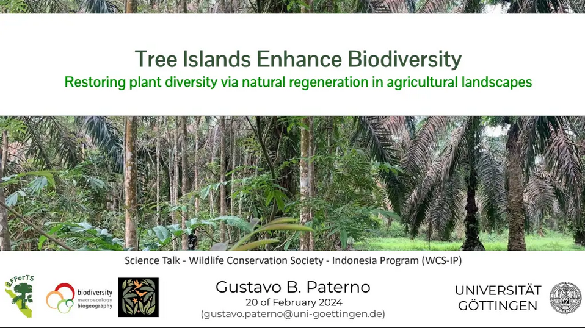

### Assciated publications

**Paterno, G.B.**</u>\*\*\*\*\*, Brambach, F., Guerrero-Ramírez, N., Zemp, D. C., Cantillo, A. F., Camarretta, N., Moura, C. C. M., Gailing, O., Ballauff, J., Polle, A., Schlund, M., Erasmi, S., Iddris, N. A., Khokthong, W., Sundawati, L., Irawan, B., Hölscher, D., & Kreft, H. (2024). [Diverse and larger tree islands promote native tree diversity in oil palm landscapes](/publication/2024-paterno/). Science, 386(6723), 795--802.[\[doi\]](https://doi.org/10.1126/science.ado1629)
